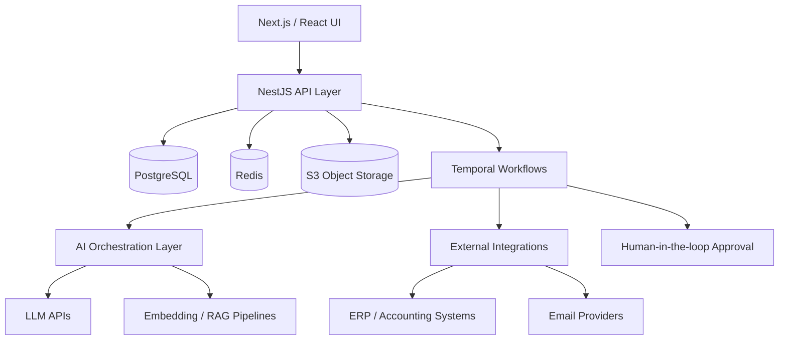

# Vivanta Operations OS

> Designed as a foundation for AI-driven property operations and scalable workflow automation.

AI-assisted property operations platform designed to reduce manual workload across document handling, invoice operations, communications, approvals, and case management.

Built as an internal system of action for property management, with a clear path toward scalable platformization.

---

## Why this exists

Property management is operationally dense, fragmented, and still heavily manual. Critical workflows such as document handling, invoice approvals, communications, and maintenance coordination are often spread across disconnected systems.

Vivanta Operations OS is designed to consolidate these workflows into a single operational backbone, where structured data, durable workflows, and AI assistance work together to improve efficiency, consistency, and visibility.

---

## Product Principles

- Operator-first, platform-ready
- Workflow-centric, not screen-centric
- AI-assisted, not AI-dependent
- Auditability before autonomy
- Modular architecture for long-term scale

---

## V1 Focus (Operational Wedge)

- Document intake and classification
- Invoice extraction and approval workflows
- Communications triage and routing
- Operational case and maintenance management

---

## System Architecture

---

## Architecture Overview

Frontend
- Next.js
- React
- TypeScript

Backend
- NestJS
- Modular architecture

Data Layer
- PostgreSQL

Workflow Orchestration
- Temporal

Infrastructure
- Redis
- S3-compatible storage

AI Layer
- LLM integrations
- RAG pipelines
- Embedding systems
- Python workers (optional)

---

## Architectural Approach

Modular monolith backed by durable workflows.

---

## Core Workflows

Document Intake and Classification
- Upload / email ingestion
- OCR + extraction
- AI classification
- Routing

Invoice Extraction and Approval
- Extract fields
- Validate
- Approval workflow
- Export

Communication Triage
- Message ingestion
- Classification
- Routing
- Task creation

Case and Maintenance
- Case creation
- Vendor assignment
- SLA tracking

---

## Example Workflow (Conceptual)

Invoice Processing Flow

1. Receive invoice
2. Extract data
3. Validate
4. Approve
5. Export
6. Audit log

---

## Core Domain Model

- Property, Unit
- Owner, Vendor
- Document, Invoice
- CommunicationThread
- Case, WorkOrder
- WorkflowRun

---

## System of Record Strategy

Operational truth:
- documents
- workflows
- communications

External:
- accounting
- payments

---

## Repository Structure

vivanta-ops/

  apps/
    api/
    web/
    worker-ai/

  packages/
    domain/
    ui/
    config/
    observability/

  infra/
    docker/
    terraform/

  docs/
    architecture/
    workflows/
    adr/

  scripts/

---

## Current Status

- Monorepo initialized
- Backend scaffolding
- PostgreSQL integration

---

## Next Steps

- Auth / RBAC
- Domain models
- Document ingestion
- Workflow engine
- AI integration

---

## Future Direction

- Predictive maintenance
- Automation
- Vendor optimization

---

## Summary

System of action for property operations.

---

## Author

Scott Dinwiddie
Berlin, Germany
